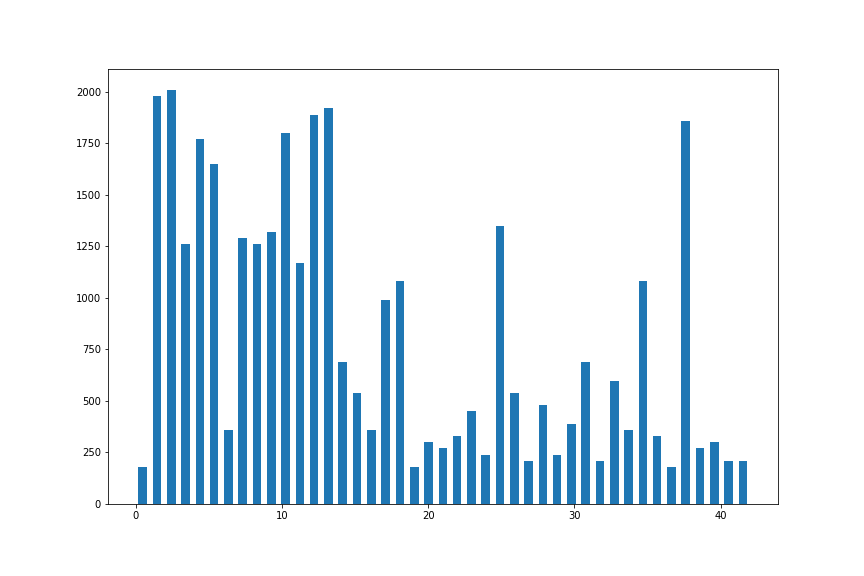
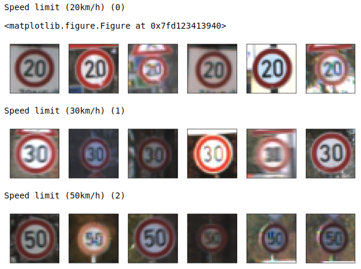
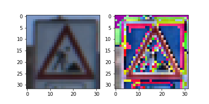
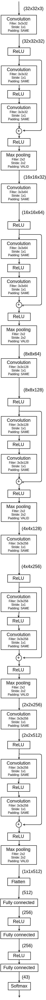
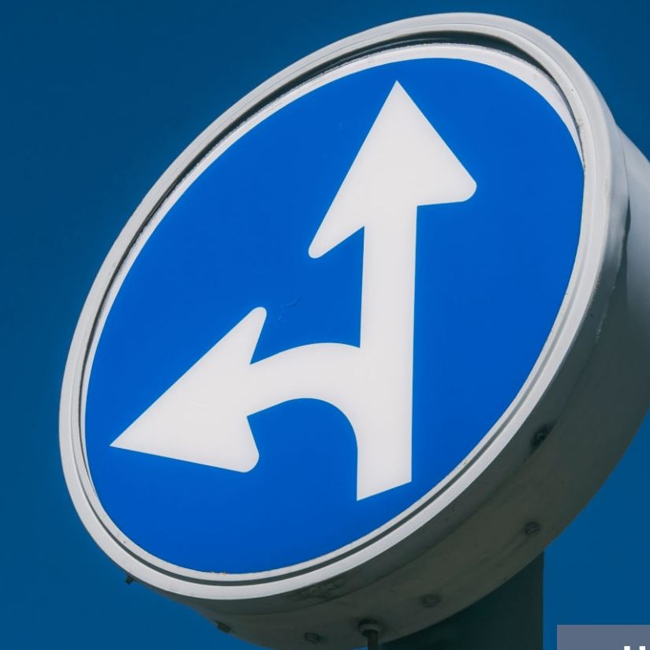
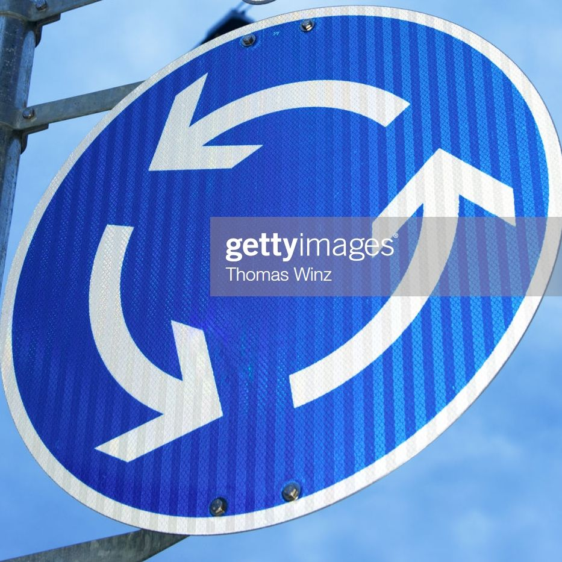
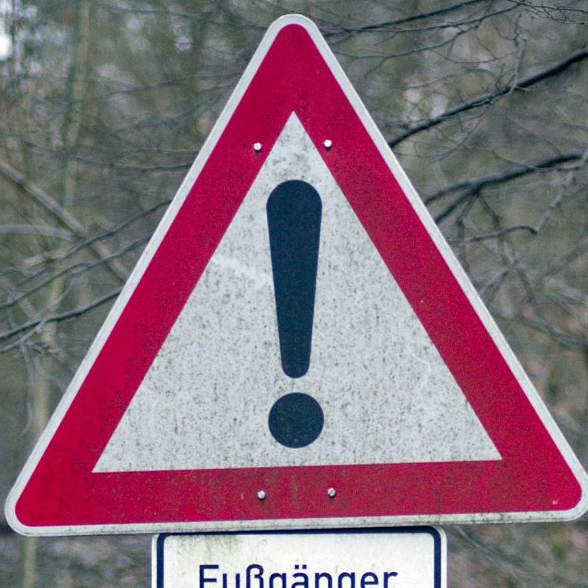
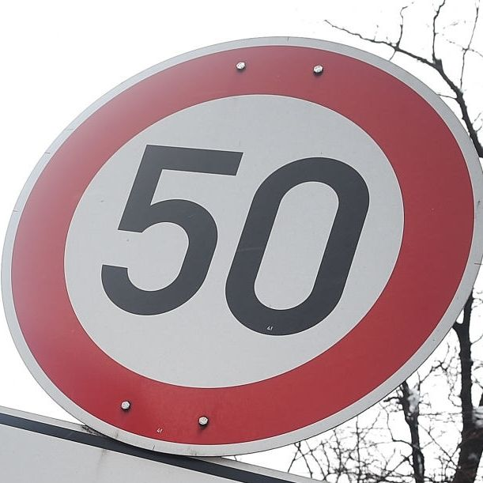
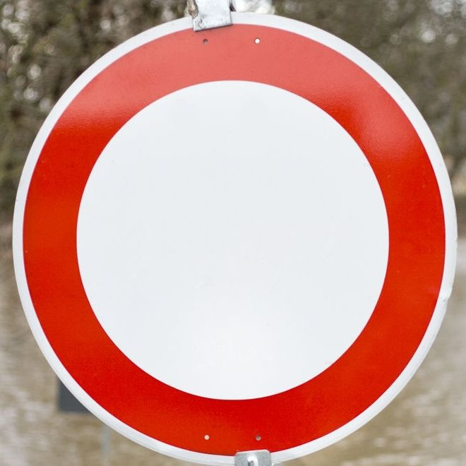

# **Traffic Sign Recognition** 

## Writeup

---

**Build a Traffic Sign Recognition Project**

The goals / steps of this project are the following:
* Load the data set (see below for links to the project data set)
* Explore, summarize and visualize the data set
* Design, train and test a model architecture
* Use the model to make predictions on new images
* Analyze the softmax probabilities of the new images
* Summarize the results with a written report


## Rubric Points
### Here I will consider the [rubric points](https://review.udacity.com/#!/rubrics/481/view) individually and describe how I addressed each point in my implementation.  


### Writeup / README


#### 1. Provide a Writeup / README that includes all the rubric points and how you addressed each one. You can submit your writeup as markdown or pdf. You can use this template as a guide for writing the report. The submission includes the project code.

You're reading it! and here is a link to my [project code](https://github.com/udacity/CarND-Traffic-Sign-Classifier-Project/blob/master/Traffic_Sign_Classifier.ipynb)


### Data Set Summary & Exploration


#### 1. Provide a basic summary of the data set. In the code, the analysis should be done using python, numpy and/or pandas methods rather than hardcoding results manually.

I used the numpy library to calculate summary statistics of the traffic signs data set:

* The size of training set is 34799
* The size of the validation set is 4410
* The size of test set is 12630
* The shape of a traffic sign image is (32, 32, 3)
* The number of unique classes/labels in the data set is 43


#### 2. Include an exploratory visualization of the dataset.

Here is an exploratory visualization of the data set. It is a bar chart showing the size of training set for each label.



Next, here is an example plot of the images of training set.




### Design and Test a Model Architecture


#### 1. Describe how you preprocessed the image data. What techniques were chosen and why did you choose these techniques? Consider including images showing the output of each preprocessing technique. Pre-processing refers to techniques such as converting to grayscale, normalization, etc. (OPTIONAL: As described in the "Stand Out Suggestions" part of the rubric, if you generated additional data for training, describe why you decided to generate additional data, how you generated the data, and provide example images of the additional data. Then describe the characteristics of the augmented training set like number of images in the set, number of images for each class, etc.)

I standardized the image data so as to prevent the values of weights in the networks becoming too large.

Here is an example of an original image and a standardized image:




#### 2. Describe what your final model architecture looks like including model type, layers, layer sizes, connectivity, etc.) Consider including a diagram and/or table describing the final model.

My final model contains 15 convolution layers and 3 fully connected layers.
There are 5 residual layers consisting of 2 convolution layers.

The model looks like this:




#### 3. Describe how you trained your model. The discussion can include the type of optimizer, the batch size, number of epochs and any hyperparameters such as learning rate.

To train the model, I used Adam optimizer.

The parameters for training were:
* the number of epochs: 10
* batch size: 128
* learning rate: 0.001
* randomization seed for tensorflow and numpy: 12 


#### 4. Describe the approach taken for finding a solution and getting the validation set accuracy to be at least 0.93. Include in the discussion the results on the training, validation and test sets and where in the code these were calculated. Your approach may have been an iterative process, in which case, outline the steps you took to get to the final solution and why you chose those steps. Perhaps your solution involved an already well known implementation or architecture. In this case, discuss why you think the architecture is suitable for the current problem.

My final model results were:
* training set accuracy: 0.994
* validation set accuracy:  0.963
* test set accuracy: 0.951

I built the network based on [ResNet](https://arxiv.org/abs/1512.03385) architecture.
It has won the 1st place in ImageNet 2015, the image classification competition.
Thus I thought it could be also applied to traffic sign classification task.
However, my network is not so deep as the proposed one.

With regard to the final model's accuracy, I think the model is not as well as I expected first.


### Test a Model on New Images

#### 1. Choose five German traffic signs found on the web and provide them in the report. For each image, discuss what quality or qualities might be difficult to classify.

Here are five German traffic signs that I found on the web:







The second image might be difficult to classify because there is a caption popup in the image, which could be a noise for classification.


#### 2. Discuss the model's predictions on these new traffic signs and compare the results to predicting on the test set. At a minimum, discuss what the predictions were, the accuracy on these new predictions, and compare the accuracy to the accuracy on the test set (OPTIONAL: Discuss the results in more detail as described in the "Stand Out Suggestions" part of the rubric).

Here are the results of the prediction:

| Image                | Prediction           |
| :------------------- | :------------------- |
| Go straight or left  | Go straight or left  |
| Roundabout mandatory | Keep left            |
| General caution      | General caution      |
| Speed limit (50km/h) | Speed limit (50km/h) |
| No vehicles          | Speed limit (50km/h) |

The model was able to correctly guess 3 of the 5 traffic signs, which gives an accuracy of 60%.
This is much lower than the accuracy on test set.

The misprediction on the second image is not surprising, as I previously discussed.

However, the 5th image was mispredicted even though it seems simple enough to classify correctly.
I suspect the bias in the number of images of each class in training dataset causes this issue, because the images labeled as "No vehicles" are much fewer than the images labeled as "Speed limit (30km/h)" or "Speed limit (50km/h)", and they are similar in shape.


#### 3. Describe how certain the model is when predicting on each of the five new images by looking at the softmax probabilities for each prediction. Provide the top 5 softmax probabilities for each image along with the sign type of each probability. (OPTIONAL: as described in the "Stand Out Suggestions" part of the rubric, visualizations can also be provided such as bar charts)

The code for making predictions on my final model is located in the 29th cell of the Ipython notebook.

The top five soft max probabilities of each five new images were:

##### 1st: Go straight or left
| Probability | Prediction                            |
| ----------- | ------------------------------------- |
| 1.000       | **Go straight or left**               |
| 0.000       | Ahead only                            |
| 0.000       | Keep left                             |
| 0.000       | Traffic signals                       |
| 0.000       | Right-of-way at the next intersection |

##### 2nd: Roundabout mandatory
| Probability | Prediction           |
| ----------- | -------------------- |
| 0.984       | Keep left            |
| 0.006       | **Roundabout mandatory** |
| 0.003       | Keep right           |
| 0.003       | Go straight or right |
| 0.001       | Turn right ahead     |

##### 3rd: General caution
| Probability | Prediction       |
| ----------- | ---------------- |
| 1.000       | **General caution** |
| 0.000       | Yield            |
| 0.000       | Traffic signals  |
| 0.000       | Turn right ahead |
| 0.000       | Double curve     |

##### 4th: Speed limit (50km/h)
| Probability | Prediction            |
| ----------- | --------------------- |
| 0.955       | **Speed limit (50km/h)** |
| 0.025       | Speed limit (30km/h)  |
| 0.011       | Speed limit (80km/h)  |
| 0.008       | Speed limit (70km/h)  |
| 0.000       | Speed limit (100km/h) |

##### 5th: No vehicles
| Probability | Prediction           |
| ----------- | -------------------- |
| 0.768       | Speed limit (50km/h) |
| 0.211       | Speed limit (30km/h) |
| 0.017       | **No vehicles**      |
| 0.003       | Speed limit (30km/h) |
| 0.001       | No passing           |

For correctly predicted images (the 1st, 3rd and 4th images), the model was pretty sure about prediction (with 100%, 100%, 95% confidence).

For mispredicted images (the 2nd and 5th images), the model made misprediction with relatively high confidence and the probability of correct class was very small.


### (Optional) Visualizing the Neural Network (See Step 4 of the Ipython notebook for more details)
#### 1. Discuss the visual output of your trained network's feature maps. What characteristics did the neural network use to make classifications?


```python

```
